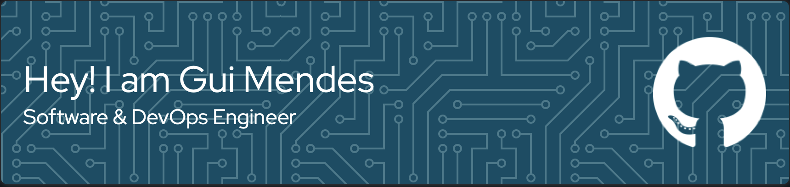

  <div align="center">
    
  </div>  
  <div align="center">
    
    
  </div>  

### <div align="center"></div>  

```go
  var gMendes = Profile{
	Name: "Guilherme Mendes", 
	Location: "Amsterdam, NL", 
	Birthplace: "Santos, BR", 
	LivedCountries: []string{"BR", "JP", "NL"}, 
	Hobbies: []string{"Travel", "Cats", "Music", "Photography", "Bike", "Videogame"},
	EagerToLearn: []string{"React", "Python", "LLM"}
	Languages: []Language{
		{ Name: "pt-BR", Level:"native"},
		{ Name: "en-US", Level:"fluent"},
		{ Name: "es-ES", Level:"intermediate"},
		{ Name: "jp-JP", Level:"basic"},
		{ Name: "nl-NL", Level:"basic"},
	}, 
	Experiences: []Job{
		{ Role: "Sofware & DevOps Engineer", Company: "Gain.pro", StartYear: 2023, CurrentEmployer: true, MainStack: []string{"go", "gcp", "pulumi", "postgres"} },
		{ Role: "Senior Software Engineer", Company: "Sniptech", StartYear: 2022, EndYear: 2023,  MainStack: []string{"go", "gcp", "terraform", "kubernetes", "postgres", "elasticsearch", "kafka"} },
		{ Role: "Software Engineer", Company: "CVC", StartYear: 2021, EndYear: 2022, MainStack: []string{"java", "spring", "go", "aws", "mongodb", "elasticsearch", "kafka"} },
		{ Role: "Software Engineer", Company: "Itaú", StartYear: 2017, EndYear: 2021, MainStack: []string{"java", "spring", "sybase", "kafka"} },
	},
	Education: []School{
		{ Name: "Universidade Federal do ABC", Location: "São Paulo, BR", Degree: "Bachelor in Science and Technology", StartYear: 2013, EndYear: 2017 },
		{ Name: "Shibaura Institute of Technology", Location: "Tokyo, JP", Degree: "Bachelor in Science and Technology (Exchange program)", StartYear: 2015, EndYear: 2016 },
	},
  }
  
  func (p Profile) Start() {
	  fmt.Println("wake up")
	  for _, job := range p.Experiences {
		  if job.CurrentEmployer { job.Work() break }
	  }
	  
	  for _, language := range p.Languages {
		  if language.Level == "intermediate" || language.Level == "basic" { language.Practice() }
	  }
	  
	  p.Play(Hobbies[rand.Intn(len(p.Hobbies))])
	  
	  p.Study(EagerToLearn[rand.Intn(len(EagerToLearn))])
	  
	  fmt.Println("sleep")
  }
  
  func main() {
	  gMendes.Start()
  }
```

<br/>  


## Connect  
  <div align="center">
    <a href="https://linkedin.com/in/guilherme-mendes-b5381555" target="_blank">
    
    </a>
    <a href = "mailto:guimsmendes@gmail.com">
    
    </a>
    <a href="https://instagram.com/guimsmendes" target="_blank">
    
    </a>
    <a href="https://profile.playstation.com/Gui_Mendes95" target="_blank">
    
    </a>
    <a href="https://www.hackerrank.com/profile/guimsmendes" target="_blank">
    
    </a>
    <a href="https://dev.to/guimsmendes" target="_blank">
    
    </a>
    <a href="https://medium.com/@guilhermemendes_57138" target="_blank">
    
    </a>
    <a href = "https://soundcloud.com/yunka-dj" target="_blank">
    
    </a>
    <a href = "https://www.duolingo.com/profile/guimsmende1" target="_blank">
    
    </a>

   
  </div>  
  

<br/>  


<h2>Stack </h2> 
<table align="center" style="width:100%;  text-align:center;table-layout:auto;">
  <tr>
    <td valign="center" style="width:50%; text-align:center; padding: 1000px;">
      <p align="center" style="font-weight: bold; font-size: 56px;">
         BackEnd
      </p>
      <div align="center">
        <table>
          <tr>
            <td style="padding: 20px;"><a href="https://go.dev" target="_blank"></a></td>
            <td style="padding: 20px;"><a href="https://www.java.com/en/" target="_blank"></a></td>
            <td style="padding: 20px;"><a href="https://spring.io" target="_blank"></a></td>
            <td style="padding: 20px;"><a href="https://quarkus.io" target="_blank"></a></td>
            <td style="padding: 20px;"><a href="https://kafka.apache.org" target="_blank"> </a></td>
          </tr>
          <tr>
            <td style="padding: 20px;"><a href="https://www.postgresql.org" target="_blank"> </a></td>
            <td style="padding: 20px;"><a href="https://www.mongodb.com" target="_blank"></a></td>
            <td style="padding: 20px;"><a href="https://www.elastic.co" target="_blank"></a></td>
            <td style="padding: 20px;"><a href="https://redis.io" target="_blank"></a></td>
            <td style="padding: 20px;"><a href="https://www.rabbitmq.com" target="_blank"></a></td>
          </tr>
        </table>
      </div>
    </td>
    <td valign="top" style="width:50%; text-align:center; padding: 50px;"">
      <p align="center" style="font-weight: bold; font-size: 56px;">
         DevOps
      </p>
      <div align="center">
        <table>
          <tr>
            <td style="padding: 20px;"><a href="https://cloud.google.com/" target="_blank"></a></td>
            <td style="padding: 20px;"><a href="https://www.pulumi.com/" target="_blank"></a></td>
            <td style="padding: 20px;"><a href="https://www.docker.com/" target="_blank"></a></td>
            <td style="padding: 20px;"><a href="https://kubernetes.io/" target="_blank"></a></td>
            <td style="padding: 20px;"><a href="https://www.terraform.io/" target="_blank"></a></td>
          </tr>
          <tr>      
            <td style="padding: 20px;"><a href="https://github.com/" target="_blank"></a></td>
            <td style="padding: 20px;"><a href="https://aws.amazon.com/" target="_blank"></a></td>
            <td style="padding: 20px;"><a href="https://www.jenkins.io/" target="_blank"></a></td>
            <td style="padding: 20px;"><a href="https://grafana.com/" target="_blank"></a></td>
            <td style="padding: 20px;"><a href="https://www.elastic.co/kibana/" target="_blank"></a></td>
          </tr>
        </table>
      </div>
    </td>
  </tr>
</table>  

<br/>  


<h2>Music</h2>
<p align="center">
<br/>
<a href="https://spotify-github-profile.kittinanx.com/api/view?uid=12160458370&redirect=true" target="_blank">
  
</a>
<a href="https://spotify-recently-played-readme.vercel.app/api?user=12160458370&unique=true" target="_blank">
  
</a>
<br>
</p>


  <summary><h2>Github Stats</h2></summary>


 <p align="center">
  
  
</p>
<br/>  


<!--START_SECTION:activity-->

<!--END_SECTION:activity-->


<!--START_SECTION:waka-->

```txt
Go           5 hrs 49 mins   █████████████████████▓░░░   86.59 %
SQL          29 mins         █▓░░░░░░░░░░░░░░░░░░░░░░░   07.25 %
Python       18 mins         █▒░░░░░░░░░░░░░░░░░░░░░░░   04.71 %
JavaScript   1 min           ░░░░░░░░░░░░░░░░░░░░░░░░░   00.39 %
YAML         1 min           ░░░░░░░░░░░░░░░░░░░░░░░░░   00.37 %
```

<!--END_SECTION:waka-->
[](https://github.com/ashutosh00710/github-readme-activity-graph)

